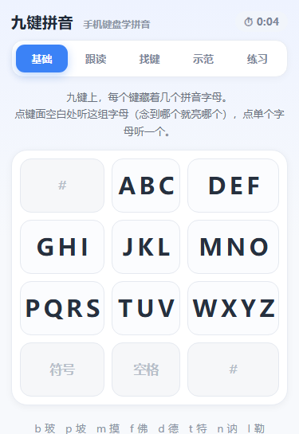
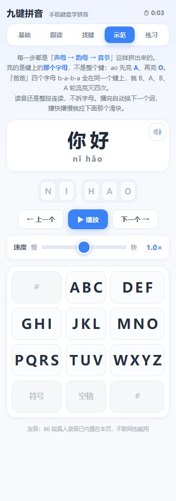
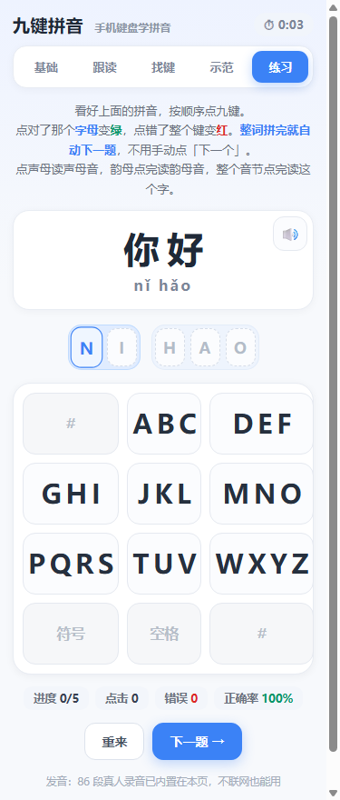

# 九键拼音

**在线试用** → <https://61a1014c8aba4675ac27698a649d9360.app.workbuddy.host>

手机浏览器打开就能用，不用下载、不用装东西。

**在手机上学会用九键打拼音。**

给不熟九键的人用——长辈、刚开始用智能手机的人、想学拼音的小孩。
不用背「哪个键上藏着哪些字母」，点着点着就记住了。

一个 HTML 文件，双击就开，**不联网也有声**。



---

## 五个页面

| 页面 | 做什么 |
|---|---|
| **基础** | 看键认字母。点键面空白处听这一组字母（念到哪个就亮哪个），点单个字母听一个。 |
| **跟读** | 程序读一个声母／韵母，同时把该按的**字母**亮起来，你照着点一下就好，整个拼音按完自动出下一个。 |
| **找键** | 屏幕上给一个拼音，自己找它藏在哪个键上。点对那个**字母**变绿，点错整个键变红，按对自动出下一题。 |
| **示范** | 看一个词怎么拼出来：**声母 → 韵母 → 音节**，键盘上逐字母亮灭。播完自动换下一个词，速度 0.4×–1.6× 可调。 |
| **练习** | 整词练习，点声母读声母音、韵母点完读韵母音、整个音节点完读这个字。整词拼完自动下一题。 |

两组容易混的页面，差在这一点：

- **跟读** vs **找键**：跟读该按哪个字母**已经亮好**了；找键要你自己想。所以跟读在前、找键在后。
- **示范** vs **练习**：示范**自动播**给你看（可调速）；练习**等你按**，按完才读。

| 示范页：亮的是字母，不是整个键 | 练习页：点对变绿，点错整键变红 |
|:---:|:---:|
|  |  |

右上角那个计时器是**本页的累计练习时长**——切到哪一页就记哪一页，五个页面各算各的；
切走、或者切到别的 App 就停表，数字存在本机，关掉再打开接着累加。

---

## 怎么用

**在线**：直接开 <https://61a1014c8aba4675ac27698a649d9360.app.workbuddy.host>，手机电脑都行。

**自己存一份**（离线也能用）：拿到 `pinyin-nine-key.html` 就行，不需要安装任何东西。

- **电脑**：双击，用浏览器打开。
- **手机**：把文件传过去（微信「文件传输助手」、QQ、数据线都行），
  在文件管理器里点一下，选浏览器打开。
- 想常驻：用浏览器的「添加到主屏幕」，之后像 App 一样一点就开。

---

## 为什么只有一个文件

拼音教学要的就是**每个音都读得准、读得及时**。这两件事各自都会踩坑：

| 做法 | 结果 |
|---|---|
| 音频放 CDN，页面里写 URL | 手机上每换一段 `src` 就是一次真实加载，一次拼读要串 3～5 段，逐段累积成「卡」；断网直接没声 |
| 用系统语音合成（TTS） | 发音质量看设备脸色；**Android 的 WebView 没有这个接口**，塞进 App 壳里反而变哑巴 |
| **把录音内联进页面**（本程序） | 每段 0 延迟，断网、飞行模式、直接发给别人，都一样有声 |

代价是文件大：**真实代码 87 KB，录音占 950 KB**（86 段 mp3 → base64）。
这一份体积换「不卡 + 离线 + 不依赖系统语音」，是划算的。

录音播放时转成 `blob:` 本地地址，不发任何网络请求；页面底部那行
「86 段真人录音已内置在本页，不联网也能用」就是当前状态的实话。

---

## 里面有什么

| | |
|---|---|
| 声母 | 23 个。声母不能单独成音节、没有独立录音，所以借它们的**呼读音**——`b` 读「玻」用 `bo1.mp3`，`zh` 读「知」用 `zhi1.mp3`。 |
| 韵母 | 24 个。`ü` 内部一律写作 `v`（`v→迂`、`ve→约`），只在显示时转回 `ü`。 |
| 词库 | 16 个常用词：你好、妈妈、爸爸、苹果、学校、老师、朋友、中国、太阳、星星、蓝天、白云、火车、小猫、花朵、大树 |
| 录音 | 86 段真人发音，来自百度汉语。 |

---

## 浏览器要求

任意现代浏览器都行（Chrome / Edge / Safari / 手机自带浏览器）。
不挑版本、不需要联网、**不需要系统语音合成**——所以放进 WebView 或 App 壳里也有声。

---

## 项目结构

```
pinyin-nine-key.html     程序本体：单文件，自带全部录音，拷走就能跑
build/inline_audio.py    重新生成内联音频（改词库 / 换录音后跑它）
build/audio_names.json   录音名单（86 段）
build/audio_cache/       录音原件，86 段 mp3
_check/                  开发期自检页 —— headless Chrome 跑断言，改完代码跑一遍
docs/                    README 用的截图
```

改完程序想自己验一遍：`_check/run_check.py` 会用无头 Chrome 打开对应自检页、
把断言结果打印出来。比如 `python _check/run_check.py speedgap.html` 验示范页调速，
`offline.html` 验断网后是否 86 段录音全部命中且 0 次 TTS。

---

## 许可

代码 MIT（见 [LICENSE](LICENSE)）。内置的 86 段录音来自百度汉语，版权归原出处。
